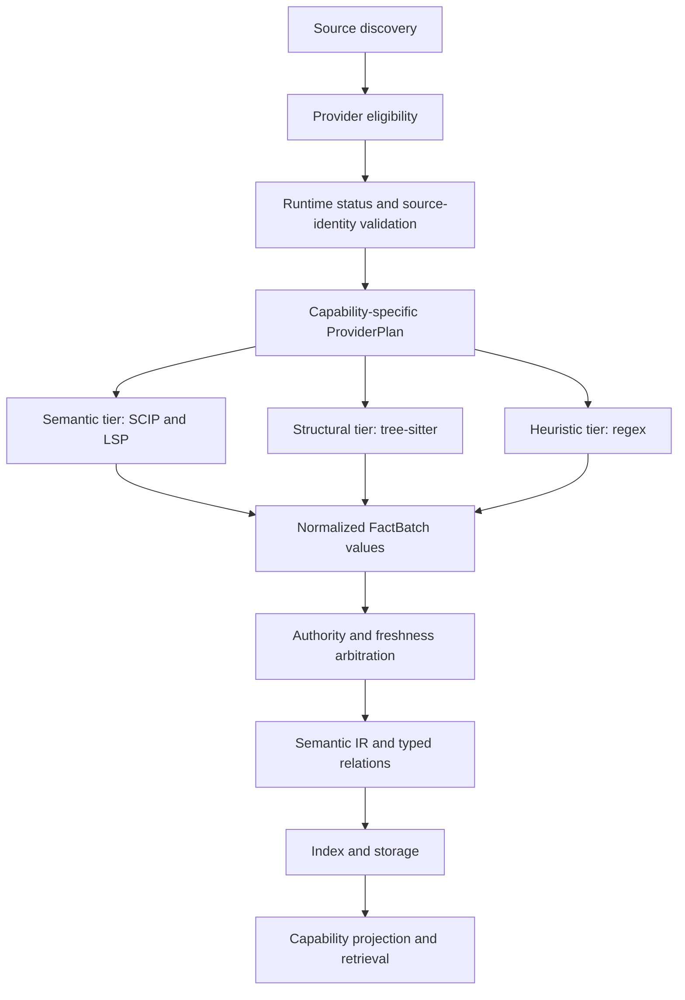
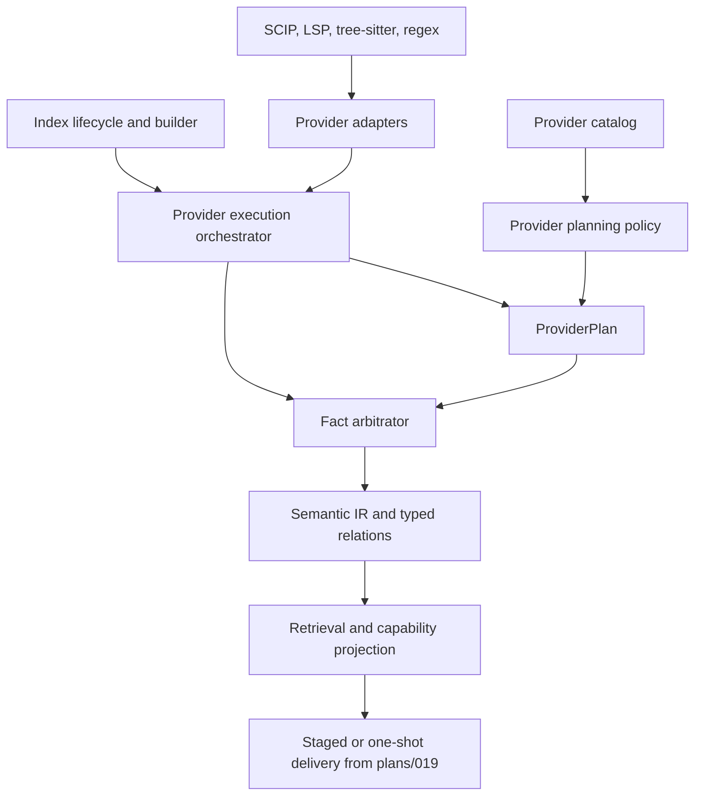
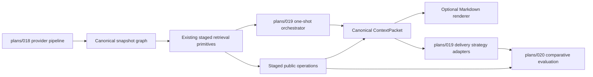

# Architecture Plan: Semantic Provider Authority Migration

Decision dependency: accepted
[`ADR-046`](../adr/046-prefer-semantic-evidence-providers-over-structural-and-lexical-fallbacks.md).

This is the approved architecture plan for the migration. Independent review is
the required first delivery stage and must complete before source implementation
begins. The repo-managed tree-sitter operational boundary is ADR-047.
The latest independent review and resolved plan findings are recorded in
[`reports/022`](../reports/022_latest_active_plans_architecture_review.md).
The Stage 0 execution, independent review findings, and baseline are recorded in
the companion progress log
[`reports/024`](../reports/024_semantic_provider_authority_stage0_progress_log.md).

## Goal

Migrate Java and TypeScript from regex-first single-parser dispatch to a
capability-specific provider pipeline in which:

- fresh SCIP and LSP facts are the semantic-authority tier;
- tree-sitter supplies structural facts and fills semantic-provider gaps;
- regex is a bounded, explicitly degraded last resort;
- all facts normalize into the existing Semantic IR and canonical typed-relation
  graph;
- external provider absence never removes the basic local indexing path.

## Scope

In:

- Provider-plan, fact-batch, evidence, status, and arbitration contracts.
- Multi-provider orchestration for Java and TypeScript.
- SCIP artifact ingestion for TypeScript, then Java.
- LSP live-overlay enrichment for TypeScript, then Java.
- Tree-sitter and regex adaptation behind the same provider boundary.
- Source-identity validation, explicit degradation, bounded provider execution,
  and deterministic evidence merging.
- Shadow comparison, confidence recalibration, compatibility migration, and
  public additive provider summaries.

Out:

- Implementing an LSP server or SCIP indexer inside semidx.
- Making an external provider mandatory for basic indexing.
- Editing, rename, refactoring, completion, or diagnostic UI features.
- Migrating every language lane in the first tranche.
- Replacing typed relations with provider-native graph formats.
- A general plugin marketplace, runtime classloader, or remote extension SDK.
- Promoting tree-sitter or regex evidence to compiler-grade authority.
- One-shot LLM delivery, Markdown rendering, or cross-strategy task evaluation;
  those belong to
  [`plans/019`](./019_llm_one_shot_context_delivery_and_evaluation_plan.md).

## Assumptions

- ADR-039 relation identity remains stable and excludes mutable evidence.
- Existing Semantic IR and typed relations remain the only normalized graph
  model; SCIP and LSP do not create parallel indexes exposed to retrieval.
- Provider integration uses client-owned, narrow function roles and data-first
  registration. Introduce a protocol only when an external runtime boundary
  requires substitution that plain functions cannot express cleanly.
- Provider-native symbols and ids are never merge keys. After source-identity
  validation, every adapter must derive the same provider-neutral
  `CanonicalFactKey` from language, path/module owner, fact kind, canonical
  symbol, and overload/dispatch identity before evidence reaches arbitration.
  Relation facts use the ADR-039 identity fields anchored to canonical
  source/target keys. Mutable source identity and evidence are excluded from
  either stable key.
- Existing public parser options remain compatibility controls during migration.
- TypeScript is the first vertical slice because its current confidence ceiling
  and regex brittleness make the improvement easiest to observe; review may
  reverse Java and TypeScript only with concrete toolchain or fixture evidence.
- LSP is primarily a live overlay. SCIP is primarily a reproducible batch
  source. Neither assumption grants authority without matching source identity.
- Provider authority is a data-plane concern. Retrieval orchestration, one-shot
  delivery, and rendering consume the canonical graph and must not inspect
  provider implementations.

## Change Model

| Expected change | Owning boundary |
|---|---|
| Add or replace a semantic provider | Provider catalog and provider adapter |
| Change authority or fallback order | Provider planning policy |
| Change freshness requirements | Provider freshness policy |
| Add an evidence field | Fact evidence contract and storage projection |
| Change conflict behavior | Fact arbitrator |
| Add a language-specific normalization rule | Provider adapter for that language |
| Change repository rebuild identity | Workspace-state provider-plan fingerprint |
| Change public degradation reporting | Capability projection |

Index lifecycle, retrieval, transports, and individual providers must not own
provider precedence.

## Target Flow



Execution order is not a whole-file short circuit. A provider that returns
definitions does not suppress a lower-tier provider needed for missing structure
or another operation. Lower tiers execute only for planned gaps or explicit
shadow comparison. Physical scheduling may precompute tree-sitter structure for
anchoring or latency reasons; the invariant is the evidence-authority and merge
order, not process start order.

## Boundaries

### 1. Provider Catalog

Responsibility: own versioned provider descriptors and role functions.

Knows about:

- provider id and version;
- language/file selectors;
- operation capability profile;
- static authority claims;
- status, freshness, and execution functions.

Does not know about:

- provider precedence;
- repository traversal;
- retrieval ranking;
- storage implementation;
- transport schemas.

Initial location: `src/semidx/runtime/providers.clj`, evolving the metadata-only
catalog currently derived from `runtime/language_registry.clj`.

### 2. Provider Planning Policy

Responsibility: produce a deterministic per-file, per-operation execution plan.

Inputs:

- file metadata and content identity;
- requested indexing operations;
- eligible descriptors;
- provider runtime status and freshness;
- project overrides;
- shadow/default mode.

Output:

```clojure
{:path "src/example.ts"
 :source_identity {:content_digest "sha256:..."}
 :operations
 {:definitions [{:provider_id "scip-typescript" :authority "exact"}
                {:provider_id "typescript-tree-sitter" :authority "structural"}
                {:provider_id "typescript-regex" :authority "heuristic"}]
  :references  [{:provider_id "scip-typescript" :authority "exact"}
                {:provider_id "typescript-lsp" :authority "exact"}
                {:provider_id "typescript-regex" :authority "heuristic"}]}
 :mode "shadow"}
```

Does not know provider execution internals or Semantic IR normalization rules.

Initial location: `src/semidx/runtime/provider_selection.clj`; extend the
plans/007 selection seam from one winner to a bounded provider plan.

### 3. Provider Execution Orchestrator

Responsibility: execute a ProviderPlan with bounded concurrency, timeouts,
failure isolation, gap tracking, and diagnostics.

Knows about provider role functions and FactBatch values. Does not decide
authority, merge semantics, retrieval confidence, or transport formatting.

Initial location: `src/semidx/runtime/provider_execution.clj`; invoked from the
file-indexing path that currently calls `adapters/parse-file` directly.

### 4. Fact Evidence And Normalization

Responsibility: convert provider-native output into normalized units, relations,
diagnostics, and evidence records.

Conceptual contract:

```clojure
{:provider_id "scip-typescript"
 :provider_version "..."
 :path "src/example.ts"
 :source_identity {:content_digest "sha256:..."
                   :revision "..."}
 :runtime_status "ready"
 :facts {:units [...]
         :relations [...]}
 :coverage {:definitions "exact"
            :references "exact"
            :call_hierarchy "none"}
 :diagnostics []}
```

Each fact carries or references one or more evidence records. The current
`parser_mode` remains a compatibility projection; new authority and provenance
fields are authoritative internally.

Primary locations:

- `src/semidx/runtime/semantic_ir.clj`;
- `src/semidx/runtime/relations.clj`;
- provider-specific adapters under `src/semidx/runtime/providers/`.

### 5. Fact Arbitrator

Responsibility: merge facts with the same canonical fact key and surface
conflicts.

Rules:

1. Reject evidence that fails source-identity, canonical-key, or schema
   validation.
2. Merge agreeing same-key facts and retain all evidence sources.
3. Let lower authority fill missing facts and missing non-conflicting details.
4. Never let lower authority replace a higher-authority value.
5. Mark equal-authority contradictions ambiguous and emit a diagnostic.
6. Produce stable ordering independent of registration or completion order.
7. Keep fact identity independent from evidence accumulation.

Initial location: `src/semidx/runtime/fact_arbitration.clj`.

### 6. Provider Freshness Policy

Responsibility: decide whether provider output matches the intended source.

SCIP requirements:

- per-document content digest; or
- artifact revision plus verification that the covered source content matches
  the current workspace.

LSP requirements:

- intended workspace root;
- matching open-document version or content digest for live overlays;
- source identity attached to every accepted batch.

Unknown or stale identity cannot produce exact facts. The provider is skipped or
degraded for the affected file/operation.

Initial location: pure functions in
`src/semidx/runtime/provider_freshness.clj`.

### 7. Capability And Degradation Projection

Responsibility: aggregate selected provider evidence into runtime-owned
capability, coverage, and degradation summaries.

Required outcomes:

- no confidence increase from provider branding alone;
- fallback-only evidence remains low and review-required;
- mixed exact/structural/heuristic coverage is visible per operation;
- `create_index`, `repo_map`, retrieval, MCP, HTTP, and gRPC serialize the same
  runtime-owned interpretation.

Primary locations:

- `src/semidx/runtime/capabilities.clj`;
- `src/semidx/runtime/retrieval_policy.clj`;
- transport passthrough and additive contract mirrors.

## Contracts

### ProviderDescriptor

```clojure
{:provider_id "typescript-lsp"
 :provider_version "1"
 :languages ["typescript"]
 :classification "semantic"
 :selectors {:extensions [".ts" ".tsx"]}
 :operation_capabilities
 {:definitions "exact"
  :references "exact"
  :implementations "exact"
  :call_hierarchy "structural"
  :document_symbols "exact"}}
```

Capability values are claims bounded by successful freshness and runtime-status
checks. They are not unconditional confidence grants.

### ProviderRuntimeStatus

```clojure
{:provider_id "typescript-lsp"
 :state "ready"                 ;; ready | degraded | unavailable
 :reason_codes []
 :observed_at "..."}
```

### CanonicalFactKey

```clojure
{:fact_schema_version "1"
 :language "java"
 :path "src/example/OrderService.java"
 :fact_kind "unit"
 :owner "example.OrderService"
 :symbol "example.OrderService#handle"
 :overload_identity {:arity 2
                     :signature_key "java.lang.String,int"}
 :dispatch_identity nil}
```

The `signature_key` above is illustrative of the two-layer model, not of what
any current Java provider emits. Verified 2026-09-05: `scip-java` supplies no
parameter types in its symbols — it disambiguates overloads with a source-order
ordinal — so the Java exact tier commits `signature_precision: "arity_only"`
with a `nil` `signature_key`, exactly like the heuristic tier. The two-layer
model is unchanged; only the assumption that the Java exact tier can supply the
typed refinement is withdrawn. See Stage 4 and
`fixtures/provider-authority/identity/java-overload-canonical-key.json`.

Relation facts use the corresponding provider-neutral form:

```clojure
{:fact_schema_version "1"
 :fact_kind "relation"
 :relation_type "dataflow/passes-argument"
 :source_unit_key {...canonical unit fact key...}
 :target_key {:language "java"
              :symbol "example.Validator#validate"
              :overload_identity {:arity 1
                                  :signature_key "java.lang.String"}}
 :flow_identity {:arg_index 0}}
```

The key is computed from provider-neutral normalized fields and is the sole
input to same-fact arbitration. Provider ids, provider-native symbol ids,
runtime status, freshness, content digests, locations, and evidence quality are
not part of the stable key. Adapters may retain native ids in evidence for
diagnostics. A fact batch is rejected or degraded when it cannot produce a
canonical key without guessing. Relation projection resolves
`source_unit_key` to ADR-039's `source_unit_id`; the normalized `target_key` and
flow identity map directly to ADR-039's remaining stable identity fields.

### FactEvidence

```clojure
{:provider_id "typescript-lsp"
 :provider_version "1"
 :canonical_fact_key {...}
 :authority "exact"
 :operation "definitions"
 :freshness "exact"
 :source_identity {:content_digest "sha256:..."
                   :document_version 42}
 :evidence_location {:path "src/example.ts"
                     :start_line 7
                     :end_line 10}}
```

### ProviderPlan

- Bounded provider list per operation.
- Deterministic stable order.
- Explicit default, forced-test, and shadow modes.
- Exact source identity used to build the plan.
- Explicit maximum execution count and timeout policy.

### Compatibility Projection

- Existing `units`, `relations`, `calls`, `imports`, and diagnostics remain
  available while consumers migrate.
- Existing `parser_mode` remains present during shadow migration.
- On the final default switch, regex-only Java/TypeScript units project
  `parser_mode: fallback`; this intentional confidence change requires approved
  replay evidence.
- Existing `java_engine`, `typescript_engine`, and `tree_sitter_enabled` options
  remain temporary explicit overrides and test controls before deprecation.

## Dependency Direction



- Policy depends on descriptors and evidence contracts, never SDKs or CLIs.
- SCIP, LSP, tree-sitter, and regex details plug into provider-owned adapters.
- Retrieval depends on normalized facts and evidence summaries, never provider
  implementations.
- Transports depend on runtime outputs and do not derive authority themselves.

## Coordination With plans/019 And plans/020

This plan owns the evidence data plane. `plans/019` owns LLM-facing one-shot
delivery and its strategy adapters. `plans/020` exclusively owns the protected
real-repository corpus, benchmark-run identity, cross-strategy harness, usage
normalization, price schedules, and comparative aggregation. Their shared
boundary is the canonical snapshot, ContextPacket, and plans/020 strategy-result
contract, not provider-native payloads.



Coordination rules:

- `plans/019` may ship its first one-shot slice over the current graph before
  the provider authority switch.
- `plans/018` Stage 6 consumes comparative task-value evidence from the
  `plans/020` scorecard. The scorecard may include one-shot adapters from
  `plans/019`, but provider correctness remains gated by deterministic provider
  and relation tests in this plan.
- The one-shot orchestrator and renderer must not branch on provider ids.
- Provider-native details stay outside the public retrieval contract except for
  bounded runtime-owned evidence and degradation summaries.

## Stage Execution Routing And Handoff

The table is the starting routing recommendation, not a permanent model lock.
High effort is explicitly allowed when the correctness risk justifies its cost;
it does not require a separate exception when this table or the preceding
stage's handoff recommends it. Typical justifications are canonical identity,
arbitration, freshness/concurrency, public authority changes, conflicting
evidence, or repeated verification failures. Routine fixture maintenance,
mechanical parity edits, and already-understood test repairs should remain at
medium effort unless new evidence raises the risk.

| Stage | Recommended executor | Recommended primary model | Effort | Why |
| --- | --- | --- | --- | --- |
| 0 — review and baseline | Claude Code 2.1.212+ independent reviewer teammate; lead synthesizes | Claude Opus 4.6 | high | challenge the migration independently and lock provider-neutral identity/toolchain assumptions before source work |
| 1 — evidence/arbitration | Claude Code team lead | Claude Opus 4.6 | high | `CanonicalFactKey`, ambiguity, and storage compatibility are correctness-critical contracts |
| 2 — provider shadow path | Claude Code team lead | Claude Sonnet 4.6 | medium | bounded implementation behind a default-off seam |
| 3 — TypeScript SCIP | Claude Code team lead | Claude Sonnet 4.6 | high | source identity and cross-provider normalization enter the weakest current lane |
| 4 — Java SCIP | Claude Code team lead | Claude Sonnet 4.6 | high | overload, constructor, import, and relation identities need careful parity |
| 4.5 — project-scoped provider consolidation | Claude Code team lead | Claude Opus 4.6 | high | the catalog/planner seam this stage builds is the seam Stage 6 flips; a false provider status or a plan that is not byte-identical without batch input changes default behavior silently |
| 5a — LSP overlay seam and TypeScript live provider | Claude Code team lead | Claude Opus 4.6 for readiness/review; Claude Sonnet 4.6 only for bounded implementation after a locked subplan | high for readiness and final review; medium for mechanical implementation | live freshness, document versions, cancellation, and exact-authority conflicts need high-effort decisions; descriptor/runner/test wiring may use medium effort only after those decisions are explicit. The seam built here is the one Java later reuses, so a TypeScript-shaped assumption inside it is a Stage 5b defect paid for twice |
| 5b — Java LSP provider | Claude Code team lead | Claude Opus 4.6 | high | blocked on a repo-managed jdtls toolchain decision; workspace initialization and classpath discovery are their own risk and must not be mixed into the seam |
| 6 — default switch | Claude Code team lead | Claude Opus 4.6 | high | this is the public authority and truthful-degradation decision gate |
| 7 — cleanup | Claude Code team lead | Claude Sonnet 4.6 | medium | removal follows proven compatibility and retention gates |

Claude Code may use at most two concurrent teammates for independent fixture,
toolchain, or read-only regression work. The lead remains the sole owner of
production edits and stage commits. Teammates must have disjoint file ownership;
Fable and the repository-prohibited Explore agent are excluded.

At the end of every stage, after verification and before the stage-closing
commit, the executing model must read:

1. the candidate next stage and its routing row in this plan, plus any applicable
   coordination or execution-admission gates;
2. the companion progress log, current `MEMORY.md`, and relevant `SPEC.md`
   decision or stop rules;
3. the completed stage diff, verification results, unresolved findings, and
   current file ownership across parallel worktrees;
4. current executor/model availability and quota constraints.

It must then add a `NextStageRoutingRecommendation` to the progress log with:

```text
completed_stage, recommended_next_stage,
recommended_executor, recommended_model, effort,
effort_justification, rationale, prerequisites_or_blockers,
file_ownership_and_conflict_risk,
fallback_executor_or_model,
model_availability_checked_at, confidence
```

The recommendation may retain or override the table default, but any override
must cite stage evidence. A `high` recommendation must contain a concrete
`effort_justification`. If no companion progress log exists, Stage 0 creates it
before recording the recommendation. If a stop/kill rule fires or prerequisites
are absent, the model must recommend `stop` or `defer` instead of auto-starting
work. The handoff is recorded in the same commit as the stage progress update
and never bypasses an owner approval or admission gate.

## Implementation Sequence

### Stage 0. Independent Review And Compatibility Baseline

Goal: independently challenge the accepted authority model before source
implementation.

Deliverables:

- Independent review of ADR-046 and this plan.
- Explicit resolution of review findings.
- Protected Java and TypeScript fixtures for definitions, references, calls,
  overloads, re-exports, dirty-file behavior, and provider unavailability.
- Cross-provider identity fixtures proving that regex, tree-sitter, SCIP, and
  LSP spellings of the same Java overload or TypeScript re-export normalize to
  one `CanonicalFactKey`, while distinct overloads remain distinct.
- Baselines for retrieval selections, callers/callees, impact, snapshot diff,
  confidence, latency, and snapshot size.
- A reusable provider-quality baseline that `plans/020` can include in its
  cross-strategy scorecard, optionally through the delivery adapters supplied by
  `plans/019`, without duplicating fixtures.

Exit criteria:

- Independent review findings are recorded and resolved or explicitly deferred.
- Intentional future semantic differences are named before code changes.
- Baseline comparisons are deterministic.

Commit boundary: documentation and baseline fixtures only.

### Stage 1. Evidence Model And Arbitration Kernel

Goal: establish stable contracts without changing default extraction.

Deliverables:

- Additive FactEvidence and FactBatch normalization.
- Provider-neutral `CanonicalFactKey` normalization before arbitration,
  including explicit unkeyable/ambiguous diagnostics.
- Deterministic same-key merge.
- Authority, freshness, and conflict rules.
- Additive multi-source relation evidence compatible with ADR-039.
- In-memory and PostgreSQL round-trip coverage.
- Property-style tests proving registration and completion order do not change
  merged output.

Exit criteria:

- Same semantic fact from multiple providers produces one canonical fact key
  and keeps one unit/relation identity; provider-native ids remain evidence only.
- Java overloads, TypeScript re-exports, and dispatch-sensitive identities have
  cross-provider golden parity before any external provider slice begins.
- Lower authority cannot overwrite higher authority.
- Equal-authority contradictions are observable.
- Existing snapshots remain readable.

Commit boundary: evidence contracts and pure arbitration only.

### Stage 2. Provider Plan And Legacy Adapter Shadow Path

Goal: prove orchestration using providers already present in the repository.

Deliverables:

- Data-first provider catalog.
- Capability-specific ProviderPlan.
- Provider execution orchestrator with bounded concurrency and timeouts.
- Java/TypeScript tree-sitter provider adapters.
- Java/TypeScript regex provider adapters classified as heuristic.
- Compatibility adapter preserving the current `adapters/parse-file` facade.
- Shadow output that does not affect the active snapshot.

Exit criteria:

- Existing default output remains unchanged.
- Shadow provider output is deterministic.
- Tree-sitter unavailability routes to regex with an explicit degradation.
- Regex shadow facts carry heuristic authority and never exact authority.

Commit boundary: provider seam and shadow execution, no default switch.

### Stage 3. TypeScript SCIP Vertical Slice

Goal: prove reproducible compiler-grade batch evidence in the lowest-confidence
current lane.

Deliverables:

- SCIP artifact reader behind a provider adapter.
- Source-identity and artifact-version validation.
- TypeScript definitions, references, implementations, and available call facts
  normalized into units and typed relations.
- Shadow comparison against current TypeScript extraction.
- Provider coverage, conflict, stale-artifact, latency, and storage metrics.

Exit criteria:

- Stale or mismatched SCIP artifacts never produce exact facts.
- SCIP facts merge with tree-sitter structure without duplicate semantic
  identities.
- Protected TypeScript retrieval cases do not regress; approved improvements are
  recorded explicitly.
- Absence of a SCIP artifact degrades to tree-sitter/regex without index failure.

Commit boundary: TypeScript SCIP provider remains shadow/default-off.

### Stage 4. Java SCIP Vertical Slice

Goal: reuse the proven SCIP seam for Java without widening the core contracts.

Deliverables and gates mirror Stage 3, with Java-specific coverage for overloads,
constructors, inheritance, static imports, method references, entity fields, and
field-write relations.

#### Amendment (owner decision, 2026-09-05): Java overload identity is arity-only

Stage 4 preflight indexed the protected Java corpus with real `scip-java`
(`semanticdb-javac` 0.12.3 + `scip-semanticdb` 0.12.3) and found the Stage 0
fixture's seeded SCIP spelling to be false. Verified behaviour:

- the symbol scheme is `semanticdb`, not `scip-java`;
- overloads carry a **source-order ordinal** (`handle().`, `handle(+1).`), not a
  typed signature; the ordinal counts over the method name across all arities;
- neither parameter types nor arity are recoverable from the moniker;
- arity and a human-readable signature come only from
  `SymbolInformation.signature_documentation.text`, whose type names are simple
  and whose parameter names are included — the shape F1 rejected as Variant B;
- fully-qualified parameter types exist only as separate occurrences inside the
  method's declaration range.

Therefore the Java exact tier commits:

```clojure
{:arity n :signature_precision "arity_only" :signature_key nil :ordinal nil}
```

The native symbol, the `+N` disambiguator, and the raw signature documentation
are **evidence only** and must never enter the canonical key. Reconstructing a
typed signature from occurrence layout is inference, and this plan forbids
guessing a canonical key; a wrong key is worse than an honest arity-only one.

Additional deliverables:

- A repo-managed **external** Java SCIP toolchain: pinned jars installed by a
  setup script into a gitignored directory, a committed minimal Java driver
  (`scip-semanticdb` ships no CLI entry point), and an adapter that invokes
  `javac` and `java` as external processes. The toolchain is never added to the
  semidx runtime classpath, mirroring ADR-047 and the Stage 3 TypeScript
  pattern, so no provider dependency can conflict with the runtime protobuf and
  gRPC stack.
- A same-arity ambiguity guard (below).

Exit criteria:

- No TypeScript-specific rule enters the shared SCIP adapter boundary.
- Java state-invariant facts preserve stable relation identity while gaining
  richer evidence.
- Provider absence and stale artifacts degrade cleanly.
- **Same-arity overloads never produce a false exact identity.** With every Java
  exact fact at `arity_only`, two genuinely distinct same-arity overloads share a
  core key and carry no typed signature to split on, so the arbitrator's
  common-case branch would merge them into one exact canonical fact with no
  diagnostic. This was reproduced on 2026-09-05 and is a hard requirement, not an
  observation. The Java adapter must:
  1. detect a group of two or more definition facts sharing
     `(language, path, owner, symbol, arity)` where every fact is `arity_only`;
  2. never emit a single exact canonical fact for that group;
  3. emit a diagnostic naming the ambiguous group; and
  4. withhold the exact contribution for that group so the lower tiers supply the
     units, rather than assert an exact identity it cannot justify.

  Non-ambiguous groups are unaffected and still merge with the heuristic tier on
  the core key.

Commit boundary: Java SCIP provider remains shadow/default-off.

### Stage 4.5. Project-Scoped Provider Consolidation

Owner decision (2026-09-05): this consolidation runs before Stage 5, not after.

Goal: make the delivered SCIP providers ordinary participants of the provider
catalog, planning policy, and execution boundary while default extraction,
public confidence, and the legacy Java/TypeScript paths stay exactly as they
are.

Why here: Stages 3 and 4 shipped `semidx.runtime.providers.scip-typescript` and
`semidx.runtime.providers.scip-java` as standalone entry points. SCIP indexes a
project, not a file, so neither provider is in `providers/descriptors`, and
`provider-selection` / `provider-execution` have never planned or executed an
exact-tier provider. Stage 5 adds a live overlay and Stage 6 flips the public
default; without this stage those two would have to land catalog integration,
batch execution, live freshness, and the authority change together. This stage
moves the batch-integration risk ahead of the authority risk and leaves it
inert.

In scope:

- provider scope as an explicit descriptor field, and catalog ownership of the
  two SCIP descriptors;
- a project-scoped status probe that cannot report a false `ready`;
- a project batch plan whose admitted/excluded records use the shape the
  per-file plan already uses;
- a batch execution boundary that runs each admitted project provider once and
  distributes its facts to the documents it covered;
- an optional batch-coverage input to per-file planning, absent by default;
- the per-document freshness gate asserted as one cross-language contract;
- shadow comparison promoted to a standard project-level diagnostic output.

Out of scope:

- any default-authority change; Stage 6 owns it;
- LSP, any third language, and the SCIP `Relationship` / implementations /
  `call/*` facts already deferred by Stage 4;
- wiring into `semidx.runtime.index` or `semidx.runtime.adapters`, that is, the
  snapshot path;
- confidence ceilings, contract schema changes, and public transport fields;
- removing or deprecating any legacy Java/TypeScript path or parser option.

Decisions:

1. **Descriptor scope is explicit and the catalog owns both SCIP descriptors.**
   `providers/descriptors` gains `:scope :file` on its four existing entries, and
   a sibling `project-descriptors` var carries the `scip-typescript` and
   `scip-java` descriptors currently defined inside the adapter namespaces. The
   adapters re-export the catalog entry rather than defining it, so there is one
   source of truth and the dependency runs adapter -> catalog. The catalog must
   not require the adapter namespaces: `semidx.runtime.scip` loads generated
   protobuf classes, and the catalog is required by the per-file planning path,
   which must keep loading without them.
2. **`descriptors-for` stays file-scoped.** The per-file candidate list must not
   change, so it filters `:scope :file`. Project-scoped ids stay reachable
   through `descriptor` / `descriptors-by-id`.
3. **`provider-status` must refuse project-scoped ids.** It currently returns
   `ready` for every non-tree-sitter engine, so a SCIP descriptor reaching it
   would report `ready` with no toolchain probe at all — a false status the
   planner would then admit. It returns an explicit unsupported-scope status
   instead, and the project probe is a separate role that calls each adapter's
   own `provider-status`.
4. **Batch execution is a new namespace, not an extension of
   `provider-execution`.** `semidx.runtime.provider-batch` owns the project role
   registry (one status function and one run function per project provider),
   executes each admitted provider once, and distributes facts by document path.
   Keeping it separate is what confines the protobuf-backed SCIP dependency to
   one namespace and leaves per-file execution untouched.
5. **Per-file planning takes batch coverage as an optional input.**
   `provider-selection/provider-plan` accepts an optional `:batch_coverage` map
   of `provider_id -> covered paths`. When present, the project provider is
   admitted for a file inside that coverage; when absent, the plan is identical
   to today's. This is the falsifiable form of "no default change".
6. **The freshness gate is not reimplemented.**
   `scip-adapter/document-freshness`, `scip-adapter/document-path-problem`, and
   the arity-only overload guard stay where they are. This stage asserts them as
   one cross-language contract at the batch boundary and reports
   fresh / stale / invalid / uncovered document counts uniformly for both
   languages.

Deliverables:

- `:scope` on every descriptor; `providers/project-descriptors`, a project
  descriptor lookup, and a scope-refusing `provider-status`.
- `provider-selection` project batch planning: bounded, deterministic, with the
  same admitted/excluded record shape as `plan-operation`.
- `semidx.runtime.provider-batch`: project role registry, one run per admitted
  provider, path-keyed fact distribution, per-provider failure isolation, and a
  coverage/diagnostics summary.
- Optional `:batch_coverage` input on `provider-plan`, plus a project-level
  shadow entry point composing batch execution with the existing
  `provider-execution/shadow-facts-for-file`.
- `scip-shadow-compare` extended to emit the project-level comparison as a
  standard diagnostic: agreed, exact-only, legacy-only, and authority-upgrade
  keys, plus fresh/stale/invalid/uncovered document counts, latency, and
  fact-set size.
- Tests as named under Verification, and the progress-log entry recording the
  observed comparison numbers.

Exit criteria:

- With no `:batch_coverage` supplied, `provider-plan`, `execute-plan`, and
  `shadow-facts-for-file` produce unchanged output for the protected Java and
  TypeScript corpora, asserted against the pre-stage output rather than a
  hand-written expectation.
- `adapters/parse-file` is untouched and default Java/TypeScript extraction is
  byte-identical.
- A project provider is admitted only with an observed `ready` status; an
  unobserved status is an exclusion with a recorded reason, exactly as the
  per-file planner already does.
- A missing CLI or toolchain, a failed index run, a stale document, and an
  unsafe document path each produce a recorded degradation and zero exact
  contributions, and never fail the run or the per-file path.
- Both SCIP providers produce the same document-state vocabulary and the same
  withheld-overload behavior through the shared boundary; no language-specific
  branch enters `provider-batch`.
- A canonical fact reaching arbitration from a batch provider and from a
  per-file provider still collapses to one canonical fact retaining both
  evidence records — the Stage 3 co-arbitration proof, now run through the
  planner instead of the standalone harness.
- Batch execution order does not change arbitrated output.
- The project shadow comparison runs on the protected corpora, and its numbers
  are recorded in the progress log as Stage 6 admission evidence.

Verification:

- Focused: `clojure -M:test -n` for `semidx.runtime.providers-test`,
  `semidx.runtime.provider-selection-test`,
  `semidx.runtime.provider-execution-test`, the new
  `semidx.runtime.provider-batch-test`,
  `semidx.runtime.providers.scip-typescript-test`,
  `semidx.runtime.providers.scip-java-test`, and
  `semidx.runtime.providers.scip-shadow-compare-test`.
- Repository gates: `clojure -M:test`, `./scripts/validate-contracts.sh`,
  `./scripts/run-mvp-gates.sh`, `clojure -M:ccc check --root .`.
- Toolchain-sensitive tests assert whichever branch the environment actually
  exercises and go through `semidx.test-support.scip-toolchain`, so a CI run
  with `SEMIDX_REQUIRE_SCIP_TOOLCHAINS=1` fails instead of skipping. Run them
  once with and once without a resolvable toolchain.

Stop conditions:

- If catalog integration cannot keep per-file output identical without changing
  `providers/run-provider` dispatch, stop and record the finding instead of
  widening the seam.
- If a deliverable requires touching `semidx.runtime.index` or
  `semidx.runtime.adapters`, stop: that wiring belongs to Stage 6.
- If a public contract or a confidence ceiling would have to change, stop and
  route the change through the Stage 6 approval instead.

Commit boundary: catalog, planning, batch execution, and shadow comparison only.
Both SCIP providers remain default-off; no default switch and no public contract
change.

### Stage 5. LSP Live Overlay

Prerequisite: Stage 4.5, so the overlay joins an existing exact-tier provider
model instead of introducing one.

Execution routing note (owner decision, 2026-09-05): split Stage 5 by risk, not
by habit. Use a high-effort model for the Plan Readiness Gate,
source-identity/freshness decisions, document-version semantics, cancellation
and timeout behavior, exact-authority conflict handling, and the final
findings-first review. Use a medium-effort implementation pass only after that
high-effort pass has produced a locked subplan with concrete files, contracts,
tests, DoD, and stop/resume conditions. If the implementation pass has to decide
product behavior, authority semantics, source identity, or conflict policy, it
must stop and return to high-effort planning instead of guessing.

Goal: add exact evidence for live or dirty workspace content not represented by
the batch SCIP snapshot.

Scope split (owner decision, 2026-09-05): Stage 5 is delivered as **5a** — the
language-neutral overlay seam plus one complete real provider — and **5b** — the
Java provider over that same seam. The reasoning is recorded because it
constrains 5a rather than merely ordering it: a seam proved only against mocks
would have its lifecycle, `initialize`, `didOpen`, document-version, and timeout
assumptions rewritten the moment a real server arrived, so 5a must ship a real
backend; and jdtls is an infrastructure problem of its own (workspace directory,
initialization latency, classpath discovery, toolchain size) that would mix two
unrelated risks into one stage. TypeScript is therefore 5a's backend, and no
TypeScript lifecycle assumption may enter the seam.

#### Stage 5a. LSP Overlay Seam And TypeScript Live Provider

Deliverables — language-neutral, and required to stay so:

- An `lsp-overlay` / `lsp-provider` boundary. `provider-selection` and
  `provider-execution` must not name `typescript-lsp` or branch on it.
- Descriptor fields: `:scope :file`, `:provider_family :lsp`,
  `:live_overlay true`.
- Source-identity contract: workspace root, path, and document version or
  content digest.
- Lifecycle wrapper: one LSP session per indexing/overlay operation, following
  the ADR-049 pattern already proven by the Zig lane.
- An injectable fact-source role: document -> LSP result -> `FactBatch`.
- One failure taxonomy for every LSP provider: `unavailable`, `timeout`,
  `crash`, `stale_document`, `version_mismatch`, `malformed_response`.
- Merge tests driven through the injected fact-source: clean agreement, dirty
  LSP override, stale SCIP exclusion, and equal-authority conflict.

Deliverables — TypeScript-specific, and deliberately thin:

- Repo-managed `typescript-language-server` install and resolution, following
  the ADR-047 chain used by the SCIP toolchains.
- An explicit rejection of `tsserver`: the TypeScript package already vendored
  under `.scip-toolchain` speaks its own protocol, not LSP, and must not be
  reused as one.
- `documentSymbol` and reference extraction mapping.
- Normalization of TypeScript LSP symbols into the existing `CanonicalFactKey`.
- The one real-toolchain end-to-end test.

Exit criteria:

- LSP facts are accepted only for matching source content.
- Dirty-file LSP evidence affects only the intended overlay/snapshot scope.
- LSP timeout or crash cannot fail unrelated files or the whole index.
- Batch snapshots remain reproducible when live overlay mode is disabled.
- No TypeScript-only lifecycle assumption — npm/node process shape, CLI naming,
  or startup semantics — appears in the seam, the planner, or the executor.
- Every failure-taxonomy value is reachable in a test.

Commit boundary: LSP remains opt-in and shadowed.

#### Stage 5b. Java LSP Provider

Unblocked by owner decision (2026-09-05): jdtls is installed as a **repo-managed
sha256-pinned tarball** in a gitignored `.jdtls-toolchain/`, the direct analogue
of the pinned jars the Java SCIP toolchain already uses. An ambient `PATH`
jdtls remains unacceptable under ADR-047.

It consumes the Stage 5a seam unchanged; if it cannot, that is a finding against
5a, not a reason to widen 5b.

##### Preflight findings (2026-09-05, real jdtls 1.54.0)

Verified against the protected Java corpus before any code was written, in the
same spirit as the Stage 4 preflight:

- **jdtls requires JDK 21 or newer.** Under JDK 17 it does not start at all:
  `Unresolved requirement: osgi.ee; filter:="(&(osgi.ee=JavaSE)(version=21))"`,
  and the launcher then reports the application as missing from the registry.
  The JVM that runs the server is therefore resolved and version-checked
  separately from the JVM that runs semidx, which may remain 17.
- **Members arrive late, and their absence is silent.** Immediately after
  `didOpen`, `documentSymbol` returns only the package and the class, with no
  children and no error. The provider must poll until members appear and treat
  exhaustion as an explicit degradation, never emit the early, incomplete answer
  as if it were complete.
- **The `arity_only` floor is confirmed, not lifted.** Method symbols are named
  `handle(String)`, `handle(String, int)`, `handleAll(List<String>)`, and the
  constructor `OrderService(Validator)`. Arity is recoverable; the parameter
  types are **simple names**, which is exactly the form Stage 4 rejected as
  Variant B for `scip-java`. Types stay evidence, never key material.
- **References are not available in this mode.** `textDocument/references` for
  `Validator#validate` returns empty even though the corpus calls it twice from
  another file: without a build file jdtls runs an invisible project with no
  resolved classpath. The descriptor therefore claims `definitions` only —
  claiming `references` would report a permanent gap on every file, the same
  mistake Stage 2 refused to make.
- The server starts in about three seconds, needs a writable `-configuration`
  directory and a `-data` workspace directory outside the repository, and picks
  a per-platform `config_*` directory. None of that reaches the seam.

##### Deliverables

- `scripts/setup-jdtls.sh`: sha256-pinned tarball download into a gitignored
  `.jdtls-toolchain/`, failing closed on digest mismatch.
- `semidx.runtime.providers.lsp-java`: toolchain and JVM resolution with an
  explicit JDK-version check, session startup, readiness polling, and symbol
  normalization onto the existing `CanonicalFactKey` spelling
  (`example.OrderService#handle`, arity-only overload identity).
- A `java-lsp` catalog descriptor claiming `definitions` only.
- One role entry in `provider-overlay/overlay-roles`, and nothing else in the
  seam.

##### Exit criteria

- The seam is unchanged: `provider-overlay`, `provider-selection`, and
  `provider-execution` gain no Java-specific branch.
- A Java LSP definition lands on the same canonical key as the `scip-java` and
  regex spellings of the same method, and the two `handle` overloads stay
  distinct by arity.
- A JDK below 21, a missing toolchain, and a project that never becomes ready
  each degrade with a named reason and produce no facts.
- The end-to-end test runs a real jdtls and is asserted, not skipped, when the
  toolchain is required.

Commit boundary: Java overlay remains opt-in and shadowed.

#### Stage 6a. Pipeline Wiring, Default-Off (complete, 2026-09-06)

Goal: make the provider pipeline run where real indexing happens, without making
it authoritative.

Why separately from Stage 6: Stage 6's exit criteria require comparative
evidence, and `plans/020` — the track that was to supply it — is paused. Until
this stage the pipeline had never executed during an actual index build, only
through fixtures and standalone shadow entry points, so there was nothing to
compare against the path in use. `plans/022` then made real sessions
observable, which turned "wire it up so it can be measured" from an assertion
into something with a measuring instrument behind it.

Delivered:

- `index/provider-pipeline-mode`: `:off` (default) or `:shadow`, read from
  parser opts as keyword or string.
- In `:shadow`, every provider-eligible path in the build is run through
  `provider-execution/shadow-facts-for-file`, and the observations reduce to an
  additive `:provider_summary` — counts, authority distribution, diagnostic
  codes, latency. Never the facts themselves, which would duplicate the
  snapshot.
- The summary rides on the `create_index` usage event, which is the provider
  summary `plans/022` asked for.
- A provider that throws is counted as a failed observation; a shadow run can
  never fail a real build.

Exit criteria, all met:

- A default build is unchanged, and carries **no** `:provider_summary` key at
  all — conditional rather than nil-valued, because a snapshot is serialized,
  diffed, and round-tripped, so an always-present key would change the shape of
  every build. A test asserts the absence, and caught exactly that mistake.
- A shadow build produces the same units and the same unit identities as a
  default one: an observation, not a second opinion.
- Telemetry carries the summary only when the pipeline ran.

Not in scope, and unchanged: authority, confidence, `parser_mode`, and the
default extraction path. Stage 6 still owns all four.

##### Live verification (2026-09-06), and one defect it found

Checked against a real MCP server and the live telemetry database rather than
against tests, because the exit criteria above are all about a path in use.

- **Defect, fixed here: the summary never reached a real session.** Stage 6a
  attached `provider_summary` to the usage event emitted by
  `semidx.core/create-index`. The MCP surface passes `:suppress_usage_metrics
  true` and emits its own event from `mcp/tool-create-index`, whose payload was
  a literal map — so on the only surface that produces real sessions the key was
  silently absent. The Stage 6a tests missed it because they exercised the
  library surface. Now covered by a test that drives `handle-tools-call` and
  fails without the fix.
- **Cost is small, and smaller than previously stated.** Full rebuild of this
  repository, 243 files: 13.9 s default against 15.1 s in shadow, of which the
  pipeline itself accounts for 1.85 s — about 9%. An earlier note warning of a
  noticeable slowdown on large repositories was not measured and overstated it.
- **What shadow actually observes today is one tier, not two.**
  `provider-shadow-for-file` calls `shadow-facts-for-file` without
  `:batch_coverage` or `:observed_statuses`, so only file-scoped descriptors are
  planned, and `locally-probed-engines` is `#{:tree-sitter :regex}`. Project
  SCIP and the LSP overlay therefore never run in a real build. On a host with
  no tree-sitter grammar that leaves regex alone: the live run recorded 1404
  facts over 46 files, **all** `heuristic`, with 99
  `equal_authority_value_conflict` diagnostics.

The third point is a limit on the stage rather than a defect in it — 6a wired
the seam it said it would — but it means the exact-versus-legacy evidence Stage 6
needs cannot come from this wiring as it stands.

#### Stage 6b. Comparative Observation (complete, 2026-09-06)

Goal: make the shadow observation say how the exact tier and the legacy tier
*relate*, not just how much each produced.

Why separately from Stage 6: this answers the first of the two questions Stage 6
bundles — *does the switch change facts, and in which direction* — and it
answers it locally, on real repositories, without `plans/020`. The second
question, whether the switch helps an agent finish a task, still needs a
comparative arm or accumulated telemetry and stays with Stage 6.

Delivered:

- The build's shadow run goes through
  `provider-batch/shadow-facts-for-project` instead of per-file
  `shadow-facts-for-file`, so the project providers run once and their coverage
  reaches per-file planning. This is the seam Stage 4.5 built and 6a did not
  use.
- `provider_summary` gains `:providers` — per provider `result` plus fresh /
  stale / invalid / uncovered document counts — and `:comparison`: `agreed`,
  `exact_only`, `legacy_only`, `authority_upgrades`, `multi_provider_symbols`.
  Counts only. `scip-shadow-compare/project-report` stays the single owner of
  what the comparison means; the symbol lists it also returns are facts and do
  not belong on an event.
- The SCIP adapters are resolved on first use rather than required at the top of
  `provider-batch`, and `target/classes` is on the `:mcp` and `:mcp-http`
  classpaths. Before this the deployed server could not load the project seam at
  all: the generated protobuf classes are a build output that only the test
  aliases carried, so `requiring-resolve` threw `ClassNotFoundException
  scip.Scip$Diagnostic`. A deployment that has not built them now reports
  `scip_runtime_classes_unavailable` — its own reason code, because an unbuilt
  classpath and a broken probe are different operator problems and the class
  loader's message names neither.

Measured on the protected Java corpus, where the exact tier is `ready`: 5 agreed
symbols, 5 authority upgrades from heuristic to exact, 1 exact-only, 0
legacy-only, and 5 symbols collapsing to one canonical fact carrying both
providers. That is the Stage 6 admission evidence in its intended shape, now
produced by an ordinary build rather than by a harness.

Measured on this repository, which is not a TypeScript or Java project: both
providers `failed` with `scip_index_failed`, 39 and 7 documents uncovered, and
the comparison reads `legacy_only 1404`. Correct and readable — but the failed
attempts cost about 5.3 s of the 6.1 s that shadow mode adds to a 14 s build
(20.1 s against 14.0 s, measured through a real MCP server). **A provider that
cannot index a workspace is retried on every build.** Not fixed here; recorded
as the next cheap improvement, since a per-workspace negative result would
remove nearly all of the cost.

Exit criteria, all met:

- A default build is still unchanged and carries no `provider_summary`.
- A shadow build produces the same units and unit identities as a default one.
- A provider whose toolchain is absent, whose classes were never built, or whose
  index run fails degrades with a named reason and contributes nothing.
- The whole observation is contained: a throw marks every eligible path failed
  and never reaches the build.
- Verified against a live MCP server and the telemetry database, not only in
  tests.

#### Stage 6c. Negative Cache For Project Providers (complete, 2026-09-06)

Goal: stop paying for a project provider run that the same workspace already
proved pointless.

Why: Stage 6b measured it. On this repository both SCIP providers fail with
`scip_index_failed`, and the failed attempts accounted for about 5.3 s of the
6.1 s that shadow mode added to a 14 s build. The failure is a property of the
workspace — no `package.json`, no `pom.xml` — and it was rediscovered on every
build.

The risk this stage is designed around is the opposite of the cost: a
remembered failure that is wrong silently switches a semantic tier off, which is
worse than paying for the run. Three guards, all owned by
`semidx.runtime.provider-negative-cache`:

- **Default deny.** `cacheable-negative-result?` answers false for anything it
  cannot classify: a throw, a contract violation, an unbuilt classpath, an
  unnamed failure, or a result whose codes are not all on the allow-list. The
  generic `:scip_index_failed` — the only code either adapter emits today, for
  every failure mode including a caught exception — is admitted only with
  eligibility evidence behind it: the provider declares `:project_manifests` in
  the catalog and none of them is present in the workspace. A TypeScript project
  whose compile broke this morning is therefore retried, not suppressed.
- **A short TTL**, five minutes by default, so even a correct negative expires
  and an `npm install` costs one stale build at most.
- **The provider never disappears.** A hit returns a `skipped` result in the
  shape a run returns, carrying `cached_negative_result` with the original
  failure code, the fingerprint, and the expiry. `result-states` gained
  `skipped` for it: nothing failed in that run, the run was not attempted, and a
  reader of `provider_summary` should be able to tell a toolchain problem from a
  policy decision.

Where it sits: inside `run-one-project-provider`, not in `project-statuses`. A
status probe answers whether the provider *could* run; a remembered negative
answers whether running it again *can produce anything*. Keeping them apart is
what lets the status stay a truthful observation.

What invalidates an entry: the manifest signals (presence, size, mtime), the
observed status minus `:observed_at` — which carries the resolved toolchain
identity, so installing a toolchain invalidates without this namespace
duplicating any resolution logic — the forwarded provider options minus
`:expected_document_digests` (per-file content, which changes on every edit and
says nothing about project eligibility), and the provider version. Anything else
expires by TTL.

In memory only, and injectable: `:provider_negative_cache` takes an atom or
`false`, and `:provider_negative_cache_ttl_ms` / `_now_fn` override the TTL and
the clock. A disk-backed tier would need schema versioning, cleanup, corrupted
files, and cross-branch behaviour, none of which the measured problem calls for;
it is a later slice to be justified by measurement.

Measured on this repository, three consecutive shadow builds in one process:
provider time 11.1 s, then 3.9 s, then 4.1 s, with both providers reporting
`skipped` and `cached_negative_result` from the second build on. The absolute
numbers are higher than Stage 6b's because that run went through a warm MCP
server and this one through a cold `-M:test-direct` JVM; what is comparable is
the provider-attributable share, which drops by about two thirds. The
file-scoped observation is untouched: the same 99
`equal_authority_value_conflict` diagnostics before and after.

Exit criteria, all met:

- A default build is still unchanged and carries no `provider_summary`.
- A skipped provider stays in the execution, the summary, and the document
  states, contributing no coverage — exactly like the failure it stands for.
- An unclassified failure is retried; verified by disabling the classifier and
  watching the eligibility tests fail, not only by watching them pass.
- TTL expiry, a new manifest, a changed toolchain identity, and a provider
  version bump each produce a real run again.
- `clojure -M:test`: 655 tests, 3496 assertions, 0 failures.

### Stage 6. Default Authority Switch And Truthful Degradation

Goal: make the reviewed provider plan authoritative for Java and TypeScript.

Deliverables:

- Provider planner becomes the default Java/TypeScript indexing path.
- Fresh SCIP/LSP facts receive exact authority per supported operation.
- Tree-sitter becomes the structural gap-filling tier.
- Regex-only output projects `parser_mode: fallback`, heuristic evidence, and
  explicit degradation.
- Workspace fingerprint includes provider plan, provider versions, relevant
  source identities, and authority-policy version.
- Capability/confidence recalibration based on selected fact evidence.
- Additive provider summary and degradation parity across public surfaces.

Exit criteria:

- Protected contract, retrieval, relation, impact, snapshot-diff, and storage
  gates pass.
- Intentional confidence reductions for fallback-only repositories are approved.
- New semantic improvements are supported by fixture/replay evidence.
- Comparative task-value evidence from the `plans/020` scorecard, optionally
  including `plans/019` one-shot adapters, shows that the authority switch does
  not regress required-file recall, normalized cost, output budget, or
  degraded-workspace availability.
- Forced provider overrides remain available for diagnosis and rollback.

Commit boundary: default switch and public additive contract changes.

#### Execution decomposition and owner decisions (2026-09-06)

**The `plans/020` gate was waived by the owner on 2026-09-06.** It is recorded
here rather than deleted from the exit criteria above, because the criterion was
not met and a later reader must not read the switch as evidence-backed on task
value. What stands in its place as admission evidence: the Stage 6b comparison
on the protected Java corpus (5 agreed, 5 authority upgrades, 1 exact-only, 0
legacy-only), the protected replay and fixture gates, and no regression in the
existing retrieval fixtures. What is still unanswered: whether the switch helps
an agent finish a task. Nothing in this stage may be reported as answering it.

Two policy questions the stage could not default. Both were decided by the owner
on 2026-09-06:

1. **Degradation is labelled unconditionally.** A Java or TypeScript file with
   neither a semantic provider nor tree-sitter projects `parser_mode: fallback`,
   heuristic evidence, an explicit degradation diagnostic, and reduced
   confidence — including the common local case where no toolchain is installed
   at all. This is the intentional confidence reduction the exit criteria
   require approval for, and it is approved.
2. **An `equal_authority_value_conflict` annotates, it does not block.** The
   contradicted fact stays in the index, carries the conflict diagnostic, and
   loses confidence. The one existing exception stands: same-arity arity-only
   overloads remain withheld, because there the risk is a false exact identity
   rather than a disagreement about a value.

Sub-stages. Each ends with the suite green and its own commit; none is a
rollback point on its own, because the switch lands in 6.1 and the labelling it
implies lands in 6.2.

- **6.1 Authority mode in the default path (complete, 2026-09-07).** `index/provider-pipeline-mode`
  gains `:authority`. The project tier runs once per build before parsing, and
  its coverage and statuses reach per-file work, so the file plan sees the exact
  tier. A new boundary merges arbitrated facts with the language parse: parsed
  units keep what only the parser has (module, imports, calls, signature), a
  fact matching a unit raises its authority and evidence, and a fact with no
  parsed counterpart becomes a unit — that last part is where SCIP adds what
  regex missed. Java and TypeScript only; every other language keeps the
  single-parser path untouched.
- **6.2 Truthful degradation and confidence (complete, 2026-09-07).** Decision 1 above, plus capability
  and retrieval-confidence recalibration driven by the authority actually
  selected rather than by the descriptor's static claim.
- **6.3 Fingerprint and snapshot reuse (complete, 2026-09-07).** Provider plan, provider versions,
  relevant source identities, and the authority-policy version enter the
  workspace fingerprint, so a snapshot built under one authority model is never
  silently reused under another.
- **6.4 Surface parity (complete with one recorded gap, 2026-09-07).** The same provider summary, degradation, and capability
  payload across library, MCP, HTTP, and gRPC.
- **6.5 Gates (complete, 2026-09-07).** Contract, retrieval, relation, impact, snapshot-diff, storage,
  replay comparison, and the semantic-quality report, plus ADR-036/046/047,
  runtime docs, and MEMORY.

##### 6.1 as delivered (2026-09-07)

`semidx.runtime.provider-authority` is the merge boundary and
`index/provider-pipeline-mode` gained `:authority`. The merge is asymmetric
because the two vocabularies are: the parse stays the source of unit shape
(module, imports, calls, signature, the spans relations are built from) and the
arbitrated facts decide what that shape is worth. A fact matching a parsed unit
raises its `:authority` and records `:evidence_providers`; a fact with no parsed
counterpart becomes a unit; a contradicted unit is annotated with
`:evidence_conflict` and kept, per the owner decision above.

Three things worth recording because they were not obvious from the plan:

- **A defect blocked the stage before it started.** `tree-sitter-fallback-diagnostic`
  classified every `tree_sitter_*` code except the CLI probe as a degradation,
  and a successful structural parse emits `tree_sitter_active`. So the
  tree-sitter tier refused itself on every machine with a working grammar, the
  pipeline could only ever observe heuristic evidence, and Stage 6 would have
  labelled every Java and TypeScript file degraded no matter what was installed.
  Fixed in `7fde363`; the existing test asserted the probe case and never the
  success case, which is how it survived.
- **The file is not parsed twice.** The tier that produced the parse answers the
  pipeline from those units through the injected `run-provider` role, so the
  legacy tier costs nothing extra and the other file tier is not run at all.
  Which tier that is comes from the parse result, never from the request: a
  tree-sitter parse that fell back to regex must not be labelled structural.
- **Arbitration drops `:value`.** An arbitrated fact carries `:core_key` and
  merged evidence but no value, so a unit built from one alone would have no
  kind and no signature. The values are recovered from the pre-arbitration
  batches the same call already returns.

Measured on the committed TypeScript corpus, `:off` against `:authority`: same
six units, of which four become `exact` carrying evidence from both
`scip-typescript` and `typescript-regex`, and two stay `heuristic` where the
exact tier did not cover them. Build time 0.38 s against 4.7 s, which is the
SCIP index run for the corpus.

Not in 6.1, and deliberately: no unit is relabelled `fallback`, no confidence is
recalibrated, and `:authority` is not the default mode — the fingerprint does not
yet separate the two models, so a snapshot built under one could be reused under
the other. That is 6.2 and 6.3.

##### 6.2 as delivered (2026-09-07)

Owner decision 1, implemented where it costs least: `parser_mode` already drives
confidence, so labelling honestly was most of the work. `retrieval-policy`
counts `fallback` units to pick a coverage level and caps a fallback-only
selection at `low`; a unit whose only evidence is heuristic is now labelled
`fallback`, a file whose every unit is heuristic is labelled `fallback` and
carries a `provider_authority_degraded` diagnostic naming the excluded
providers, and the file's `:semantic_pipeline` record is kept in step so the two
cannot disagree.

The confidence recalibration is the other half, and it goes the other way. The
per-language strength — TypeScript `low`, Java `medium` — is a static claim about
how good the lane's parser is, and it was the only signal available while every
unit came from that parser. `evidence-strength` lets a selection whose units are
*wholly* exact raise the ceiling to `high`, because TypeScript is rated `low` on
account of a regular expression guessing, not on account of a SCIP index. A
partly exact selection keeps the static strength: mixed evidence is as good as
its weakest member, which is the rule the ceiling already applied across
languages. Structural evidence lifts nothing — it is not exact.

Measured on the committed TypeScript corpus, `:off` against `:authority`:

| | units | parser modes | coverage | ceiling | degraded files |
| --- | --- | --- | --- | --- | --- |
| `:off` | 6 | 6 full | full | low | 0 |
| `:authority` | 6 | 4 full, 2 fallback | mixed | low | 1 |

The ceiling stays `low` because two units remain heuristic, which is the
conservative rule working; a wholly exact selection reaches `high`, asserted
directly against `capability-summary`. The row that matters is the old one: a
regex-only index used to report coverage `full`, and now it says what it
actually is.

##### 6.3 as delivered (2026-09-07)

The hole this closes was real and silent: `capture-workspace-state` knew nothing
about the pipeline mode, so an `:authority` build and an `:off` build of the same
files produced the same fingerprint, and whichever ran second was served the
other's snapshot. Units labelled by a model the caller had switched off, or an
unlabelled snapshot answering a caller who asked for the model — both, depending
on the order.

`provider-authority/authority-model` is now the identity of the model a build
runs under, and it travels in the workspace manifest and the fingerprint.
`freshness/decide-freshness` compares it directly and forces a **full** rebuild
when it differs, ahead of the delta rule: an incremental update would leave every
untouched file carrying labels from a model that no longer applies.

Two decisions worth keeping:

- **The model is nil for `:off`**, and the key is omitted rather than set to nil,
  so a build that runs no pipeline hashes exactly what it hashed before this
  stage existed and every snapshot taken before it stays reusable. `:shadow` and
  `:authority` each get their own model, because shadow adds a summary to the
  snapshot and authority changes the units themselves.
- **Provider versions come from the catalog, not from the plan.** The question
  the fingerprint answers is whether two builds *could* have produced the same
  snapshot, and a provider present on one machine and absent on another is
  exactly what a plan would hide.

Verified end to end against in-memory storage on the Java corpus: a repeated
`:authority` build reuses (same snapshot id, caching intact), switching to `:off`
rebuilds and returns units with no authority, and switching back rebuilds again.

One defect found on the way and fixed only for this stage's reason:
`coordinate-index-lifecycle` resolves the rebuild reason through a whitelist that
sends everything unrecognised to `initial_build`, so the switch was invisible in
telemetry. `authority_model_changed` is now carried through. The four
pre-existing reasons the same whitelist swallows —
`no_prior_manifest`, `manifest_schema_incompatible`,
`provider_or_pipeline_version_changed`, `delta_exceeds_threshold` — are recorded
in [`bugs/002`](../bugs/002_rebuild_reason_whitelist_reports_initial_build.md)
rather than fixed opportunistically here.

The default flip is **not** part of this stage. The owner asked for it after 6.5,
so that it lands as a one-line change against a surface that already reports
degradation consistently and gates that have already run.

##### 6.4 as delivered (2026-09-07)

Two gaps, both of the same kind: the information existed and the surfaces did
not carry it.

**An authority build reported nothing.** `provider_summary` was emitted only in
shadow mode, so switching the pipeline on cost the operator the observation.
`provider-authority/build-summary` now produces it from what the build actually
made — not by running the pipeline a second time, which is what borrowing the
shadow path would have meant. It is deliberately not the shadow summary with a
different `:mode`: `:comparison` is absent, because shadow compares two tiers
neither of which is the snapshot while here one of them *is* the snapshot, and
`:units_supplied`, `:units_conflicted` and `:files_degraded` exist only in this
mode. `:project_elapsed_ms` covers the project tier alone — per-file provider
work is interleaved with parsing and is not honestly separable, so no total is
reported rather than an invented one.

**Capabilities described a ceiling the server can now beat.** Since 6.2 a wholly
exact selection rises above its language's static `confidence_ceiling`, and a
client reading capabilities had no way to know that. The payload gained
`provider_authority` — policy version, covered languages, available modes, and
`evidence_raises_confidence_ceiling` — with the JSON Schema, the malli mirror,
and the committed example updated together. It is static by design: it says what
the server can do, not which mode the last build ran in, so a capability response
never depends on an index.

Carrying the summary: library (`:provider_summary` on the index), MCP (both the
usage event and, new here, the tool response), HTTP (`POST /v1/index/create`).
Every one of them is conditional, so a build that runs no pipeline answers
exactly what it answered before.

**Recorded gap — gRPC — closed 2026-09-08.** `CreateIndexResponse` had no field
for the summary, and the gap was first recorded as blocked on a missing `protoc`.
That was wrong, and the mistake is worth keeping: the check had been `which
protoc` against the system PATH, while ADR-042 exists precisely so this
repository does not depend on one — `clojure -T:build grpc-generate` fetches a
pinned, sha256-verified `protoc` and `protoc-gen-grpc-java` into
`.cache/semidx/protobuf`, and both were already there.

The message now carries `provider_summary_json`, mirroring
`HealthResponse.capabilities_json`. proto3 has no absent scalar, so an opted-out
build sends an empty string and the reader turns it back into nil, which keeps
the field additive. All four surfaces — library, MCP, HTTP, gRPC — now report the
summary.

##### 6.5 as delivered (2026-09-07)

Gate results, run against this working tree:

| Gate | Result |
| --- | --- |
| `clojure -M:test` | pass |
| `./scripts/validate-contracts.sh` | pass, 72 files |
| `./scripts/run-mvp-gates.sh` | pass |
| `./scripts/run-semantic-quality-report.sh` | `advisory_failure`, unchanged from before Stage 6 |
| `clojure -M:ccc check` | was stale; refreshed |
| `./scripts/validate-language-onboarding.sh typescript` | pass, gates included |
| `./scripts/validate-language-onboarding.sh java` | **fail, 10 errors, pre-existing** |

Two of those need reading rather than ticking.

**The semantic-quality advisory failure is not this stage's.** Rather than assert
that from the shape of the change, the same report was run at `4fa9107` — the
commit before the first Stage 6 change — in a scratch worktree. The two summaries
are identical field for field: `expected_change_match_rate` 0.833,
`implementation_vs_meaning_accuracy` 0.667, `gate_eligible` false. The dataset is
advisory and was already below its thresholds.

**The Java lane fails its own onboarding checklist, and has always failed it.**
Four required artifacts have never existed in the repository's history — the
onboarding doc, two named retrieval fixtures, and the mirrored integration test —
while the fixtures Java does have use different names. TypeScript passes the same
checklist including its gates. Recorded as
[`bugs/003`](../bugs/003_java_lane_missing_onboarding_artifacts.md). It does not
block this stage, because it is a checklist gap rather than an authority-path
failure, but it should be settled before the flip: a gate that already fails
cannot fail usefully at the moment it matters.

New gates owned by this stage, in
`test/semidx/integration/provider_authority_gates_test.clj`, because the standing
gates all run the default path and say nothing about the mode being prepared:

- the switch loses no unit the default path produced, and touches no file set;
- retrieval still answers under it;
- the confidence ceiling follows the evidence rather than the lane, whichever
  toolchain the machine running the gate happens to have.

Documentation: ADR-046 gained an **Amendments** section recording the two owner
decisions as policy — annotate-not-block for equal-authority contradictions, with
the same-arity overload guard kept as the one exception, and unconditional
degradation labelling with the complement that exact evidence raises the ceiling.
ADR-036's historical marker and the ADR-046/047 cross-links were already in
place. `docs/mcp-api.md` and `docs/runtime-api.md` now describe
`provider_authority` and `provider_summary` on their surfaces.

What remains before the flip: the owner's decision on `bugs/003`, and the flip
itself — one line in `index/provider-pipeline-mode`, deliberately left for last.

##### The flip, attempted and reverted (2026-09-08)

`bugs/003` was closed by `plans/023`, so the flip was attempted: default mode
`:authority`, with an unrecognised value resolving to the default rather than to
`:off`.

It was reverted the same day. The suite failed in about twenty places across
`runtime_test`, `http_test` and `grpc_test`, and the failures were not stale
expectations. The substantive one: **impact analysis and the entire
state-invariant feature stop answering for Java on any machine without a semantic
toolchain.**

Measured on a two-file Java entity fixture, same units and same five relations
either way, only the labels differing: with the pipeline off the state-invariant
packet is complete; under `:authority` it is empty, with no entity candidates at
all.

The chain is `parser_mode "fallback"` → coverage `fallback_only` → confidence
ceiling `low` → `impact-seed-degradations` calls the selection degraded →
`impact-analysis` returns its stub without assembling the packet.

The cause is a vocabulary collision, not the owner's labelling decision.
`parser_mode "fallback"` already meant "the parser could not extract structure";
Stage 6.2 gave it a second meaning, "the evidence is heuristic", and the features
keyed to the first meaning cannot tell them apart. A successful regex parse that
produced methods, fields and relations is not a failed parse.

Recorded as
[`bugs/005`](../bugs/005_parser_mode_fallback_means_two_different_things.md) with
the fix that unblocks the flip: keep `parser_mode` for extraction failure, keep
the evidence tier on `:authority`, and have `coverage-level` and
`selected-language-strengths` read `:authority` for the heuristic case — the way
`evidence-strength` already reads it for the exact case.

One defect was found and kept from the attempt: a provider-supplied unit carried
an empty `:signature`, which fails the context packet contract with
`internal_contract_error` the moment such a unit reaches retrieval. Only an
authority build can produce those units, which is why nothing had hit it. Fixed
in `unit-from-fact`, which now falls back to the symbol.

##### The flip, landed (2026-09-08)

`bugs/005` was fixed by taking `parser_mode` back: `provider-authority` no longer
writes it, the evidence tier stays on `:authority`, and the file still says it is
degraded through its own diagnostic. The state-invariant packet came back
complete on the same fixture, and the twenty-odd failures across `runtime_test`,
`http_test` and `grpc_test` disappeared with it. What remained was thirteen
assertions whose premise was "the default is off"; each now names `off`
explicitly where it means "no pipeline".

`:authority` is the default. `:off` is the rollback and is available by name, an
unrecognised mode resolves to the default rather than silently opting a caller
out, and the deployment env var and caller options keep the precedence they had.

Measured:

| | `off` | default |
| --- | --- | --- |
| this repository | 14.8 s, 5081 units | 16.7 s, 5081 units, 1631 labelled heuristic |
| Java corpus, toolchain present | 34 ms, 5 units | 482 ms, **6 units, all exact** |

No unit is lost either way; the corpus gains one the lexical tier never produced.
Gates: suite 681/3636/0, benchmarks 31/31, contracts ok at 80 files.

Two things the flip changed that were not on the plan:

- **The snapshot no longer carries a clock.** The authority summary's
  `project_elapsed_ms` made two identical builds differ, which `snapshot-diff`
  would have reported as a change and which contradicts ADR-046's determinism
  driver. Removed. Shadow's `total_elapsed_ms` has the same flaw and was left
  alone because shadow is opt-in.
- **The confidence reduction from owner decision 1 is in effect after all.** The
  owner chose the harder half on 2026-09-08: teach the shared gate the
  difference. `impact-seed-degradations` now decides on structural signals — no
  seed, a seed the parser could not extract, ambiguity, an unresolved symbol, a
  stale index — instead of reading a low confidence level as an absence of
  structure. A heuristic-only selection then falls a step below its lane's static
  strength (Java `medium` → `low`) without taking impact analysis with it. The
  visible consequence: Java with no semantic toolchain reports
  `autonomy_blocked`, the posture every low-ceiling lane already reported, and it
  reverses as soon as an exact tier is available.


### Stage 7. Compatibility Cleanup And Expansion Decision

Goal: remove temporary duplication only after the new path is stable.

Deliverables:

- Deprecation schedule for engine-specific parser options.
- Removal of shadow-only legacy branches after the agreed retention window.
- Decision whether another language justifies provider migration.
- Updated ADR-036 historical marker, ADR-046/ADR-047 cross-links, plans/007,
  runtime docs, MEMORY, onboarding docs, and capability documentation reflecting
  the accepted authority model.

Exit criteria:

- No public consumer depends on removed compatibility behavior.
- Rollback remains possible through a documented provider-policy override during
  the retention window.
- Further language expansion requires evidence, not symmetry.

Commit boundary: cleanup only; do not combine with a new language migration.

#### Stage 7 as delivered (2026-09-08), including a withdrawn decision

**The engine-option deprecation was announced and withdrawn the same day.** It
rested on the claim that `:java_engine` and `:typescript_engine` had become
inert — "the plan admits tiers by status, so naming an engine can only agree with
it or be ignored". That is false, and checking it took one command: with
`:java_engine :tree-sitter` the parse attempts the structural path and reports
`tree_sitter_missing_grammar`, with `:regex` it does not. The option still
chooses which **local** extractor runs, and that extractor is the tier the
provider plan merges its semantic evidence with. What the option never controlled
is the semantic tier.

Worse, this plan's own Rollback Strategy says the opposite of what the schedule
proposed: *"Stage 6 retains explicit tree-sitter and regex overrides for
diagnosis and emergency rollback."* The deprecation contradicted a decision this
document already carried, and the contradiction went unnoticed until the owner
asked what removal would buy.

Withdrawn: the `deprecated_options` key, its test, and the schedule. The docs now
state what is true instead — the options select the local tier, they cannot
override the semantic one, and `:provider_pipeline "off"` is the wholesale
rollback.

**There are no shadow-only legacy branches to remove either.** `:shadow` stopped
being scaffolding when Stage 6b gave it the exact-versus-legacy `comparison`,
which exists nowhere else. The code that is only reachable under it —
`provider-shadow-observation`, `provider-shadow-summary` — is that mode's
implementation, not residue.

**What the second half was actually worth: the names.** The default path ran
through functions called `shadow-facts-for-file` and `shadow-facts-for-project`,
so every future reader of the default path met a word for something it stopped
being. Renamed to `facts-for-file` and `facts-for-project` across 14 files, and —
the part that mattered more — the docstrings around them were corrected: several
still claimed "everything here is shadow work", "no caller writes it into a
snapshot", "default extraction is untouched". All false since the flip.
`provider-overlay/shadow-facts-for-overlay` keeps its name, because the LSP
overlay genuinely is not on the default path.

**Expansion decision, unchanged**: no further language migrates. The bar is
evidence rather than symmetry, `plans/020` is still paused, and nothing measured
in Stage 6 says another lane would gain. A candidate needs a reproducibly
runnable semantic provider, a corpus where the exact tier disagrees with the
lexical one often enough to matter, and a measured retrieval difference.

**One stale metric found and fixed**: `files_degraded` counted units by
`parser_mode "fallback"`, which `bugs/005` had made impossible, so it had been
zero for every build. It reads the file diagnostic now, and a test asserts the
count agrees with the diagnostic that produced it.

Stage 7 is complete. Nothing is scheduled for removal.

## Verification Gates

Every implementation stage must run the narrowest relevant tests first and then
the applicable repository gates. The complete migration gate includes:

- provider selection and arbitration unit tests;
- Java and TypeScript onboarding validation;
- contract validation;
- complete Clojure test suite;
- semantic-quality report;
- protected retrieval replay comparison;
- cross-strategy task-value comparison from `plans/020`, with `plans/019`
  one-shot adapters when available;
- relation projection and traversal parity;
- snapshot-diff parity;
- in-memory and PostgreSQL evidence round trips;
- forced provider unavailable, stale, timeout, and conflict cases;
- CCC freshness check and MEMORY update when runtime behavior changes.

No default switch is justified by tests that cover only provider happy paths.

## Rollback Strategy

- Stage 1-5 changes are additive and default-off or shadow-only.
- Each provider can be disabled independently by project/runtime policy.
- Stage 6 retains explicit tree-sitter and regex overrides for diagnosis and
  emergency rollback.
- Snapshot provider-policy versions prevent silent reuse across authority-policy
  changes.
- A rollback never relabels heuristic evidence as exact; it explicitly reports
  reduced coverage and confidence.

## Risks

### [High] LSP is treated as a reliable batch indexer

Why it matters: LSP servers are stateful, capability-variable, and optimized for
interactive operations rather than deterministic repository export.

Mitigation: use LSP primarily as a source-validated live overlay; require bounded
operation support and retain SCIP as the reproducible semantic batch source.

### [High] Multi-provider merging creates silent semantic conflicts

Why it matters: accepting whichever provider finishes first makes output
nondeterministic and can conceal ownership disagreements.

Mitigation: pure authority/freshness policy, stable merge ordering, explicit
ambiguity, and tests randomized by registration/completion order.

### [High] Stale semantic artifacts receive exact authority

Why it matters: precise but stale definitions or references are more dangerous
than an explicit structural fallback.

Mitigation: content/revision identity is a prerequisite for exact authority;
unknown identity degrades or excludes the evidence.

### [High] The provider seam becomes a plugin framework

Why it matters: lifecycle hooks, remote loading, and a broad SDK would delay the
first semantic slice and widen the attack/maintenance surface.

Mitigation: versioned data registry plus narrow role functions only; add a
protocol when the SCIP/LSP boundary proves a concrete substitution need.

### [Medium] Fact-level evidence expands snapshots significantly

Why it matters: duplicated provider locations and metadata increase memory,
serialization, and PostgreSQL costs.

Mitigation: measure Stage 3/4 snapshots, deduplicate source identities, bound
evidence records, and retain detailed provider-native payloads outside the
canonical snapshot.

### [Medium] Truthful regex degradation lowers apparent product capability

Why it matters: current users may observe lower confidence even when raw
retrieval selections remain similar.

Mitigation: expose the reason and recommended provider setup; approve the
confidence change through replay and contract review instead of masking it.

## Independent Review Brief

The reviewing agent should treat ADR-046 as the accepted decision of record and
this plan as the approved migration direction. Challenge implementation
readiness, hidden assumptions, and unsafe sequencing rather than reopening the
authority decision by default. Review against current code, accepted ADRs, and
active plans, and report findings by severity.

Required review questions:

1. Is per-operation authority necessary, or can a simpler whole-file provider
   model meet the same correctness requirements?
2. Are SCIP and LSP correctly treated as peers whose precedence depends on
   freshness and workspace mode?
3. Is the source-identity rule sufficient to prevent stale exact facts?
4. Does the proposed `CanonicalFactKey` normalize current unit and ADR-039
   relation identities across provider spellings without collapsing distinct
   Java overloads, TypeScript re-exports, or dispatch-sensitive facts?
5. Does `FactEvidence` need a public contract immediately, or should it remain
   internal through the shadow stages?
6. Does the LSP live-overlay scope avoid turning semidx into an LSP lifecycle
   manager or nondeterministic batch indexer?
7. Are the Stage 0-6 gates sufficient to catch retrieval, confidence, storage,
   and incremental-index regressions?
8. Should TypeScript remain the first SCIP slice, or does concrete Java toolchain
   evidence justify reversing the order?
9. Verify that ADR-036 supersession, ADR-047 toolchain retention, and the
   plans/007 amendment leave no active conflicting parser-authority rule.
10. Identify any simpler design that preserves exact semantic authority,
    deterministic fallback, and explicit degradation with less machinery.
11. Verify that provider ids or provider-native payloads do not leak into the
    one-shot orchestration and rendering boundaries defined by `plans/019`.

Expected review output:

- findings ordered by severity with file/line evidence;
- implementation-readiness recommendation: proceed, proceed after named
  revisions, or block pending a named decision;
- unresolved decisions that require the project owner;
- smallest revision set needed before implementation;
- verification performed and limitations.

## Execution Admission

Stage 1 source implementation may begin only when:

- independent review findings are recorded and resolved or explicitly deferred;
- ADR-046 and ADR-047 are accepted;
- ADR-036 supersession and the plans/007 amendment are documented;
- Stage 0 baseline scope and ownership are approved;
- the provider-neutral `CanonicalFactKey` contract and cross-provider identity
  fixtures are approved;
- the project owner confirms whether TypeScript remains the first vertical slice.
