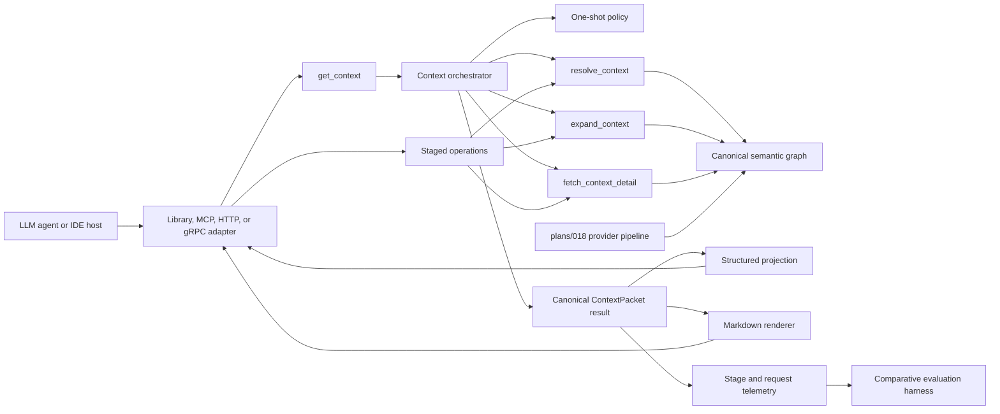
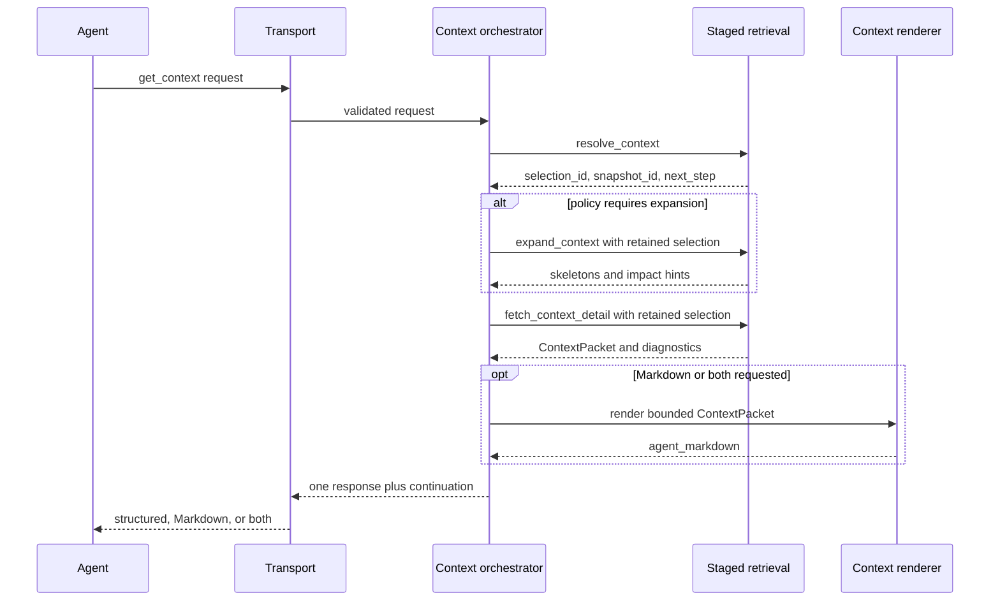
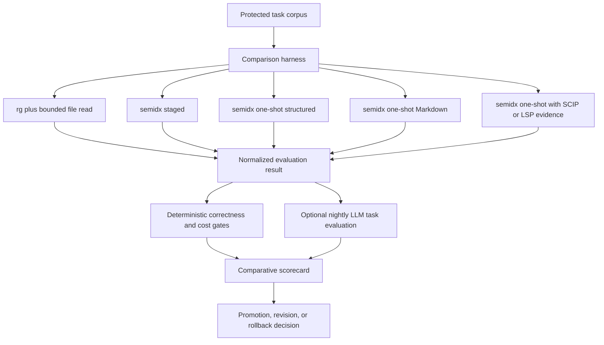

# Architecture Plan: LLM One-Shot Context Delivery And Comparative Evaluation

This plan adds an LLM-oriented composite retrieval operation, an optional
Markdown projection, and evidence that the result is more useful than simpler
alternatives. It is intentionally separate from
[`plans/018`](./018_semantic_provider_authority_migration_plan.md): that plan
owns evidence-provider authority, while this plan owns delivery and evaluation.

## Decision Boundary

ADR-024 remains the accepted decision of record: compact-first staged retrieval
is the canonical public state machine. The proposed `get_context` operation is
an additive composite facade over that state machine. It must preserve the same
snapshot-bound selection artifact, budgets, diagnostics, and typed failures.

Shipping an additive one-shot operation does not require superseding ADR-024.
Making one-shot the documented canonical default, removing staged operations,
or weakening selection stability requires a new ADR supported by comparative
evidence from this plan. Until then, staged operations remain normative and
one-shot remains a convenience surface for clients that prefer one round trip.

## Goal

Let an LLM agent request useful code context in one network round trip against
an already available workspace index while preserving:

- deterministic server-side orchestration;
- explicit token and raw-code budgets;
- snapshot and selection stability;
- the canonical structured ContextPacket;
- optional compact Markdown optimized for direct model consumption;
- continuation into the existing staged operations;
- measurable comparison with staged semidx, lexical search, and available
  language-navigation baselines.

## Scope

In:

- Library orchestration for `get-context` using existing retrieval primitives.
- An additive MCP `get_context` vertical slice, followed by HTTP/gRPC parity only
  after value is demonstrated.
- A versioned deterministic one-shot policy.
- Structured, Markdown, and combined response projections.
- Protected comparative task fixtures and measurement of quality, latency,
  round trips, and output cost.
- Compatibility with provider evidence introduced by `plans/018` without
  provider-specific delivery logic.

Out:

- Replacing or removing `resolve_context`, `expand_context`, or
  `fetch_context_detail`.
- Running an LLM inside the retrieval server to choose context.
- Making external SCIP/LSP providers mandatory for one-shot retrieval.
- Cold-start repository provisioning in the first slice; Stage 2 requires an
  `index_id` and reuses existing lifecycle behavior.
- A free-form Markdown-only contract with no structured source of truth.
- A generic workflow engine or agent framework.
- Using a nondeterministic LLM judge as a per-commit correctness gate.

## Assumptions

- The current `resolve-context-detail` helper proves that selection and detail
  can already be composed inside the library, but the new orchestration boundary
  must also support policy-controlled expansion and stage-level telemetry.
- A one-shot request reduces client round trips; latency and token savings are
  hypotheses until measured end to end.
- ContextPacket remains the authoritative result. Markdown is a pure projection
  and cannot introduce facts absent from the packet.
- Provider authority remains invisible to the orchestrator except through
  runtime-owned evidence, capability, confidence, and degradation summaries.
- The first delivery surface is MCP because it directly exercises the LLM-agent
  use case with the smallest transport blast radius.

## Change Model

| Expected change | Owning boundary |
|---|---|
| Change when one-shot expands or fetches detail | One-shot policy |
| Change stage orchestration | Context orchestrator |
| Change output formatting | Context renderer |
| Add or change a transport | Thin transport adapter |
| Change retrieval ranking or graph semantics | Existing retrieval/graph boundary |
| Add or change an evidence provider | `plans/018` provider pipeline |
| Add an evaluation strategy | Comparative evaluation harness |
| Change promotion thresholds | Versioned evaluation policy |

## Target Architecture



The orchestrator coordinates existing roles; it does not absorb retrieval,
ranking, rendering, provider selection, storage, or evaluation policy.

## Boundaries

### 1. Context Orchestrator

Responsibility: execute a bounded one-shot workflow over existing staged library
operations and assemble one response.

Knows about:

- staged operation roles;
- one-shot policy decisions;
- selection and snapshot identifiers;
- stage results, budgets, and typed errors;
- response projection requests.

Does not know about:

- SCIP, LSP, tree-sitter, or regex implementations;
- graph storage details;
- ranking internals;
- Markdown layout rules;
- benchmark expectations.

Initial location: `src/semidx/runtime/context_orchestrator.clj` with a thin
library entry point in `src/semidx/core.clj`.

### 2. One-Shot Policy

Responsibility: decide whether expansion is needed, which selected units may
receive detail, and how the request budget is allocated.

Initial shape: versioned data plus pure decision functions, not a protocol or
plugin system.

```clojure
{:policy_id "agent_default_v1"
 :expand_when #{"change_impact" "ambiguous_selection"}
 :detail_level "enclosing_unit"
 :max_selected_files 8
 :budget_split {:selection 0.10
                :expansion 0.20
                :detail 0.70}}
```

The policy must be deterministic for the same index snapshot, query, options,
and policy version.

### 3. Context Renderer

Responsibility: project a ContextPacket into bounded model-oriented Markdown.

Rules:

- code bytes are copied verbatim into fenced blocks;
- explanations are outside code fences;
- every snippet carries path and line information;
- callers, relations, selection reasons, and degradation are concise and
  reason-coded;
- no fact absent from ContextPacket may be synthesized;
- Markdown has an independent output budget and deterministic ordering;
- escaping handles backticks and user-controlled source text safely.

Initial location: `src/semidx/runtime/context_renderer.clj`.

### 4. Comparative Evaluation Harness

Responsibility: run the same protected tasks against multiple retrieval
strategies and compare normalized outcomes.

It owns strategy adapters and metrics, not retrieval implementation. A strategy
adapter returns a common evaluation result containing selected paths/symbols,
latency, request count, output size, degradation, and task evidence.

Initial location: extend `src/semidx/runtime/benchmarks.clj` only for the first
vertical slice; extract `runtime/task_evaluation.clj` after the second real
strategy proves a stable contract.

## One-Shot Contract

### Request

```clojure
{:api_version "1.0"
 :index_id "idx-..."
 :query {...}                         ;; existing retrieval query contract
 :budget {:max_output_tokens 4000
          :max_files 8
          :max_code_tokens 2800}
 :presentation {:format "structured" ;; structured | markdown | both
                :detail "auto"}       ;; auto | compact | code
 :policy_id "agent_default_v1"}
```

The first slice requires `index_id`. A future workspace reference or cold-start
mode needs separate lifecycle and authorization review because it combines
index creation cost with retrieval latency.

### Response

```clojure
{:api_version "1.0"
 :snapshot_id "snap-..."
 :selection_id "sel-..."
 :context_packet {...}
 :agent_markdown "..."               ;; only for markdown | both
 :guardrail_assessment {...}
 :diagnostics_trace {...}
 :stage_events [...]
 :degradations []
 :continuation {:can_expand true
                :can_fetch_more true
                :snapshot_id "snap-..."
                :selection_id "sel-..."}
 :budget_summary {...}}
```

Structured mode may omit `agent_markdown`. Markdown mode still returns the
minimal machine envelope, selection/snapshot identifiers, degradation, budget,
and continuation; it does not collapse the entire wire contract into prose.

### Orchestration Sequence



## Invariants

1. One-shot executes the same snapshot-bound staged semantics as direct staged
   callers.
2. The response always exposes the retained `selection_id` and `snapshot_id`.
3. A stage failure remains typed and observable; the orchestrator cannot
   silently re-resolve against a newer snapshot.
4. Total returned content cannot exceed the request hard cap.
5. Detail selection is derived only from the retained selection artifact.
6. Renderer output never feeds back into ranking or graph construction.
7. Provider availability may change evidence quality but cannot change the
   one-shot contract shape.
8. Repeated identical requests against the same retained snapshot and policy
   version produce equivalent semantic selections and deterministic rendering.

## Comparative Evaluation



Required metrics:

| Metric | Purpose |
|---|---|
| Required-path and required-symbol recall | Did the strategy find necessary code? |
| Excluded-path precision | Did it avoid known noise? |
| Relation/caller evidence recall | Did graph context add useful structure? |
| End-to-end p50/p95 latency | Did one-shot improve interactive cost? |
| Client request count | Did the composite facade remove round trips? |
| Returned tokens and bytes | Did projection reduce model input cost? |
| Index preparation time | Is provider quality hiding startup cost? |
| Degraded-workspace success rate | Does retrieval remain available without providers? |
| Stale-evidence rejection rate | Are exact facts source-valid? |
| Task completion score | Does the agent solve the protected task? |

Per-commit gates remain deterministic. LLM task evaluation runs on a pinned
model/prompt configuration outside the mandatory correctness lane and reports
variance across repeated runs.

## Implementation Sequence

### Stage 0. Independent Review And Baseline

Deliverables:

- Independent review of this plan against ADR-024, plans/018, current contracts,
  and current convenience-helper behavior.
- At least 20 protected tasks spanning code understanding, change impact, test
  targeting, and bug investigation.
- Current staged baseline for required paths/symbols, request count, returned
  tokens, and end-to-end latency.
- Explicit decision that the first slice is additive and does not change the
  canonical public default.

Exit: findings are resolved or explicitly deferred and baseline inputs are
reproducible.

Commit boundary: documentation and evaluation fixtures only.

### Stage 1. Library Orchestration

Deliverables:

- Pure one-shot policy and budget allocation.
- Context orchestrator composing existing staged operations.
- Structured `get-context` library result.
- Parity tests proving selection, snapshot, error, and detail equivalence with
  direct staged execution.
- Stage-level and aggregate usage telemetry without double counting.

Exit: no transport exposure and no ranking behavior change.

Commit boundary: library orchestration and tests only.

### Stage 2. MCP Structured Vertical Slice

Deliverables:

- Additive `get_context` MCP tool requiring an existing `index_id`.
- JSON Schema, malli mirror, examples, tool catalog entry, and handler.
- Machine-readable `tools/list` and runtime parity tests.
- Explicit continuation into existing staged tools.

Exit: one MCP request returns the same bounded semantic result as the equivalent
staged calls, with no snapshot drift.

Commit boundary: MCP structured mode only.

### Stage 3. Markdown Projection

Deliverables:

- Pure bounded renderer.
- `structured`, `markdown`, and `both` response modes.
- Escaping, deterministic ordering, code-fidelity, truncation, and token-budget
  tests.
- A/B measurement against structured mode; no default-format change yet.

Exit: Markdown is never the sole machine contract and demonstrates measured
cost or usability value on protected tasks.

Commit boundary: renderer and additive projection only.

### Stage 4. Comparative Evaluation Gate

Deliverables:

- Common strategy-result contract.
- Lexical, staged, one-shot structured, and one-shot Markdown adapters.
- Optional provider-aware strategy populated as plans/018 slices become
  available.
- Comparative scorecard with thresholds and retained baselines.
- Optional nightly pinned-LLM task evaluation.

Exit: the project can answer whether one-shot and semantic providers improve
task outcomes per unit of latency and output budget.

Commit boundary: evaluation only; do not change runtime defaults in this stage.

### Stage 5. Cross-Surface Parity

Deliverables:

- HTTP and gRPC exposure of the same runtime-owned request/result contract.
- Shared authz, rate-limit, usage, and error semantics.
- Cross-surface examples and parity tests.

Exit: MCP, HTTP, gRPC, and library differ only in transport representation.

Commit boundary: transport adapters only.

### Stage 6. Product Default Decision

Use the comparative scorecard to choose one outcome:

1. retain staged retrieval as the documented default and keep one-shot additive;
2. recommend one-shot for selected LLM clients while staged remains canonical;
3. propose a new ADR that changes the canonical public default.

No option removes staged operations. Any new default requires an accepted ADR,
updated README/runtime docs/examples, and an explicit rollback path.

## Verification Gates

- One-shot versus staged semantic parity.
- Snapshot mismatch, selection eviction, unsupported version, and truncation.
- Hard output and raw-code budget enforcement.
- Deterministic renderer snapshot tests and code-byte fidelity.
- Contract schema, malli, MCP tool-list, and runtime handler parity.
- Usage metrics count one aggregate request while retaining stage diagnostics.
- Protected comparative corpus and retained baseline.
- Complete Clojure tests and applicable contract/MVP gates before transport
  promotion.
- CCC and MEMORY freshness when runtime behavior or priorities change.

## Rollback

- Stages 1-4 are additive; disable `get_context` without changing staged tools.
- Renderer modes can be disabled independently from structured one-shot output.
- Stage 5 transport exposure is feature-gated until parity and rate-limit checks
  pass.
- Evaluation baselines are immutable inputs; a rollback records the failed
  candidate rather than rewriting prior results.
- Provider rollbacks are owned by plans/018 and remain invisible to delivery
  orchestration.

## Risks

### [High] One-shot becomes a god orchestrator

Mitigation: keep ranking, provider selection, rendering, storage, and evaluation
outside the orchestrator; orchestration owns only stage composition and budget
coordination.

### [High] Composite execution hides snapshot or stage failures

Mitigation: preserve selection/snapshot ids, typed stage errors, diagnostics,
stage events, and continuation in the one-shot response.

### [High] Markdown silently drops correctness metadata

Mitigation: keep ContextPacket authoritative and retain a minimal machine
envelope even in Markdown mode.

### [Medium] One-shot moves latency rather than reducing it

Mitigation: measure end-to-end p50/p95, server stage durations, request count,
and output size before recommending it as a client default.

### [Medium] Evaluation favors semidx-specific metadata

Mitigation: score all strategies first on task-level required paths, symbols,
and completion outcomes; treat semidx diagnostics as explanatory secondary
metrics.

### [Medium] LLM evaluation becomes a flaky CI gate

Mitigation: deterministic per-commit gates; pinned and repeated LLM runs only in
the advisory nightly/release lane until variance is understood.

## Independent Review Brief

The reviewer should challenge implementation readiness without reopening
ADR-024 or ADR-046 by default.

Required questions:

1. Is an additive external composite operation compatible with ADR-024 when the
   staged state machine remains canonical and visible?
2. Can the existing helper be reused without making `semidx.core` own rendering
   or transport policy?
3. Are the one-shot policy inputs sufficient to remain deterministic and
   snapshot-bound?
4. Does Markdown preserve code fidelity and enough machine metadata for safe
   continuation?
5. Do evaluation metrics compare task value rather than rewarding semidx-only
   diagnostics?
6. Can the MCP slice remain useful without cold-start index creation?
7. Is any proposed module premature before the second implementation variant?
8. What evidence threshold should trigger a new ADR about the canonical public
   default?

Expected output: severity-ordered findings, an implementation-readiness
recommendation, unresolved owner decisions, and the smallest required revision
set before Stage 1.

## Execution Admission

Stage 1 source implementation may begin only when:

- independent review findings are resolved or explicitly deferred;
- the protected baseline corpus and metric definitions are accepted;
- the first slice remains additive under ADR-024;
- one-shot policy and budget ownership are explicit;
- no provider-specific condition exists in orchestration or rendering.
